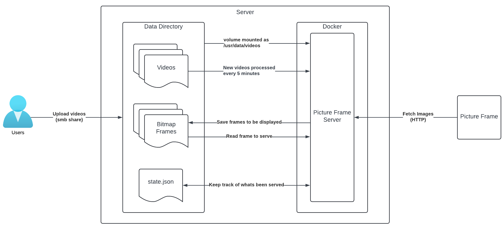

# ePaper Weather & Very Slow Home Video Player

This is a battery-powered [ePaper display](https://en.wikipedia.org/wiki/Electronic_paper) that can switch between a very slow home video player and a weather app.  A single charge of the 18650 lithium-ion battery should last several months.

By default videos are changed to five frames per second (FPS), and a new frame is shown every six minutes.  That means one second of video time takes 30 minutes of real time.  I use this to show cute videos of my kids, where it functions essentially as a black and white picture frame.  

A rocker switch on the side lets you change to a weather display.  This app is from [lmarzen / esp32-weather-epd](https://github.com/lmarzen/esp32-weather-epd) with minor updates to support the display panel I used as well as the boot loader I built to switch between apps.

Images are fetched from an HTTP endpoint.  Onboard flash storage is used to cache multiple images to limit usage of WiFi.  The microcontroller I am using can fit 207 images in cache.  With the default of showing one frame every six minutes that means new images are fetched roughly every 21 hours.  

The display I am using has a resolution of 800x480.  While it technically can show four colors (black, dark grey, light grey, white), in practice I found that caused severe ghosting.  Therefore I am sticking to purely black and white images.  Bitmaps are used for simplicity.  Only one bit is needed per pixel, so the resulting pictures are exactly 48 KB ( &nbsp;  &nbsp; (800 x 480) / 8 &nbsp;  &nbsp; ).  The server creates these bitmap frames automatically from source videos.  It uses [Floyd–Steinberg dithering](https://en.wikipedia.org/wiki/Floyd–Steinberg_dithering) to create convincing greyscale images.

The server needs access to a directory to source videos from, store bitmap frames, and persist state.  Users will need access to that directory, perhaps as a SMB share, to upload videos.  The server is designed to support multiple displays.  Each will have a directory with a name like `display1`, `display2`, etc.  You'll need to create this initial directory.  The diagram below assumes you are running the server as a docker container and volume mounting the directory as `/usr/data/videos`. 

The server checks the data directory every 5 minutes.  If any new videos are found in a display directory (e.g. `display1`) it will process them to create the necessary bitmap frames.  It will scale and crop them down to 800x480, reduce the framerate to 5 fps, dither each frame, and convert each frame to a one-bit bitmap.  While a video is being processed it will create a "temp" directory at the root of the data directory.  When processing is completed the directory with the bitmap frames will be moved to the appropriate display directory, and "temp" will be deleted.  Only one video will be processed at a time.  Once a couple videos have been processed the directory tree will look like:

* Data
  * display1
    * Family Vid 1_bitmap_frames/
    * Family Vid 1.mkv
    * Baby First Steps_bitmap_frames/
    * Baby First Steps.mov

[FFmpeg](https://ffmpeg.org) is used to do the initial video conversion.  Any file format it supports should work.

A state.json file will be created in each display directory.  This is used to keep track of the last directory/frame that was served.  

A voltages.csv file will be created in each display directory.  When the microcontroller fetches an image it includes the current battery voltage as a query string.  You can use this file to determine how quickly the battery is draining.

The HTTP endpoint requires a single query string parameter, `displayId`.  This needs to match the display directory in the data folder.  The optional `batteryVoltage` is automatically included when the microcontroller fetches an image.

`http://192.168.1.2:8080/image?displayId=1`

Everytime the HTTP endpoint is called it serves the next frame.  Once the last frame is reached it moves to the next directory in alphabetical order and starts with the first frame.  After the final frame of the final directory is shown it resets to the first frame of the first directory.  If you want to change what video or frame is being shown yourself feel free to modify state.json.  Keep in mind however that the picture frame will only fetch new images once its cache has emptied, so it may be a some hours until you see your changes.

A refresh button on the exterior of the case causes the microcontroller to wake up and either show the next video frame or update the weather display.  There is a hidden purge button, accessed via the vent hole above the refresh button, which if held down while the refresh button is pushed will cause the file system to be reformatted, triggering the app to fetch new frames from the server.  This is useful if you want to quickly switch the video is being displayed.

## High Level Architecture

# Parts Needed
* [7.5 inch e-ink screen 800x480 electronic paper display (GDEY075T7)](https://www.good-display.com/product/396.html)
* [ePaper screen adapter board (DESPI-C02)](https://www.good-display.com/product/516.html), usually sold with the display
* [Thom Patterson's Very Slow Home Video Player PCB](https://www.pcbway.com/project/shareproject/Thom_Patterson_s_Very_Slow_Home_Video_Player_PCB_kicad_pcb_62df3ee7.html)
* [Wemos D32 Pro Microcontroller](https://www.wemos.cc/en/latest/d32/d32_pro.html)
* BME280 temperature/pressure/humidity sensor ([Amazon](https://www.amazon.com/Pre-Soldered-Atmospheric-Temperature-GY-BME280-3-3-MicroControllers/dp/B0BQFV883T/), [Aliexpress](https://www.aliexpress.us/item/3256803501753106.html), make sure its 3.3V)
* 7mm momentary push button (two required, [Amazon](https://www.amazon.com/MECCANIXITY-Momentary-Soldering-Electronic-Devices/dp/B0D8B55VYT/?th=1),  [Aliexpress](https://www.aliexpress.us/item/2251832618630576.html))
* KCD1-101 rocker switch ([Amazon](https://www.amazon.com/TWTADE-Rocker-Switch-Position-KCD1-1-101/dp/B0CVTRKJTV/?th=1), [Aliexpress](https://www.aliexpress.us/item/3256802638434394.html))
* 18650 lithium-ion battery
* [Battery Contacts](https://www.amazon.com/10Pairs-Battery-Negative-Positive-Conversion/dp/B09DSQL56P/)
* JST PH 2.0 connector ([Amazon](https://www.amazon.com/Upgraded-Connector-Battery-Inductrix-Eachine/dp/B07NWD5NTN),  [Aliexpress](https://www.aliexpress.us/item/3256805305262265.html))
* M3xL4xOD5 threaded inserts (13 total)
* M3x6 screws (13 total)
* U.S. Penny (18 total, used to offset the weight of the battery and balance the unit)
* [3D printed frame](https://www.printables.com/model/1425809-epaper-weather-video)

# Setting Up
## Display Unit
* Install [PlatformIO](https://platformio.org) if required.
* Open the MicroController directory in [Visual Studio Code](https://code.visualstudio.com).
* Modify `videoApp/include/Config.h` to set:
  * `ssid` = name of your wifi
  * `password` = password of your wifi
  * `httpEndpoint` = HTTP endpoint of the server
  * `deepSleepTime` is how long a frame will be shown, in microseconds.  By default its six minutes.
* Modify `weatherApp/src/config.cpp` to set:
  * `WIFI_SSID` = name of your wifi
  * `WIFI_PASSWORD` = password of your wifi
  * `OWM_APIKEY` = your openweathermap.org api key ([see instructions here](https://github.com/lmarzen/esp32-weather-epd?tab=readme-ov-file#openweathermap-api-key))
  * `LAT` = your latitude
  * `LON` = your longitude
  * `CITY_STRING` = your city
  * `TIMEZONE` = your time zone
* Build project and upload to the connected Wemos D32 Pro board.  You will see three separate projects being built and uploaded.

## Server
* Deploy [picture-frame-server](https://hub.docker.com/repository/docker/thompatterson/picture-frame-server/general)
  * Volume mount a host path to `/usr/data/videos`
  * Bind a host port to container port 8080
* Expose that host path as a SMB share.
* Mount the SMB share and drop a video in the `display1` directory.
  * Within 5 minutes the server will process the video and create a directory with the bitmap frames.

    

# Known Bugs
* App won't switch until refresh button is pressed.

# Possible Future Enhancements
* Create a config file in flash memory that stores config for both apps.  No more need for recompiling to change settings.
* First-time setup via captive wifi and browser-based app.
* Remove the need for the server, but that means figuring a different way of creating all the frames...

# Additional Links
* [picture-frame-server](https://hub.docker.com/repository/docker/thompatterson/picture-frame-server/general) on DockerHub.
* [lmarzen / esp32-weather-epd](https://github.com/lmarzen/esp32-weather-epd)
* [ePaper Weather & Video](https://www.printables.com/model/1425809-epaper-weather-video) on Printables.